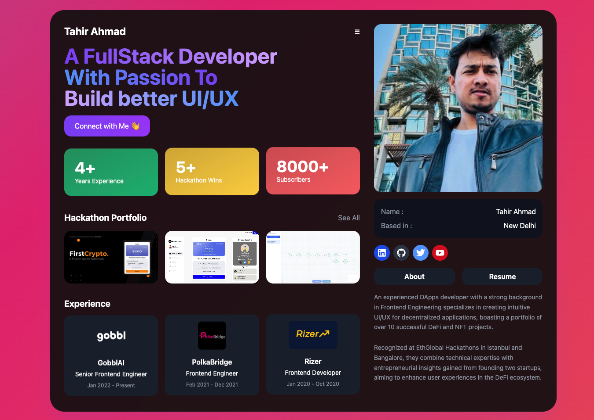

# 🌟 Tahir Ahmad - Portfolio Website

Welcome to my personal portfolio website! 🎉 This is where I showcase my journey as a Full-Stack Developer with a passion for creating exceptional UI/UX experiences.

## 🌐 Live Preview

Check out the live version here: [https://tahirahmadin.vercel.app/](https://tahirahmadin.vercel.app/)

---

## 📖 About Me

Hi there! I'm **Tahir Ahmad**, a passionate Full-Stack Developer with **4+ years of experience** in building intuitive and decentralized applications. I specialize in:

- **Frontend Engineering** for seamless UI/UX.
- **Decentralized Applications (DApps)** with a focus on DeFi and NFT ecosystems.

Recognized at **EthGlobal Hackathons** in Istanbul and Bangalore, I've combined technical expertise with entrepreneurial insights to make significant contributions to over **10+ DeFi projects**.

---

## 🏆 Highlights

- **4+ Years Experience** in Web Development.
- **5+ Hackathon Wins**, showcasing my creativity and problem-solving skills.
- Built a community of **8000+ subscribers**, sharing my knowledge and expertise.
- Successfully contributed to multiple startups and decentralized projects.

---

## 💼 Professional Experience

### [GobblAI](https://www.gobbl.io) - **Senior Frontend Engineer**

- _Jan 2022 – Present_

### PolkaBridge - **Frontend Engineer**

- _Feb 2021 – Dec 2021_

### Rizer - **Frontend Developer**

- _Jan 2020 – Oct 2020_

---

## 📫 Connect With Me

- LinkedIn: [Tahir Ahmad](https://linkedin.com/in/tahirahmadin)
- Twitter: [@yourtwitter](https://twitter.com/tahirahmadin)
- YouTube: [Your YouTube Channel](https://www.youtube.com/@tahirahmad.crypto)

---

## 📄 Resume

Want to learn more about my professional journey? [Download my Resume here](https://drive.google.com/file/d/1b2Y1rqHeak-SS0TKCeguZFaG29MIa1Zi/view).

---

## 🚀 Technologies & Skills

- Frontend: React, Next.js, Vite, Tailwind CSS
- Backend: Node.js, Express.js
- Blockchain: Solidity, Web3.js
- Tools: Figma, Git and more!
- AI Tools: Claude, ChatGPT, Bolt

---

## 👩‍💻 How It's Built

- **Frontend**: React + Tailwind CSS
- **Hosting**: Vercel / Netlify
- **Design**: Figma

---

## 🌟 Contributions Welcome!

If you have any suggestions, feedback, or want to collaborate, feel free to open an issue or reach out to me on [LinkedIn](https://linkedin.com/in/tahirahmadin).

---
